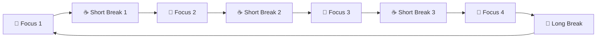
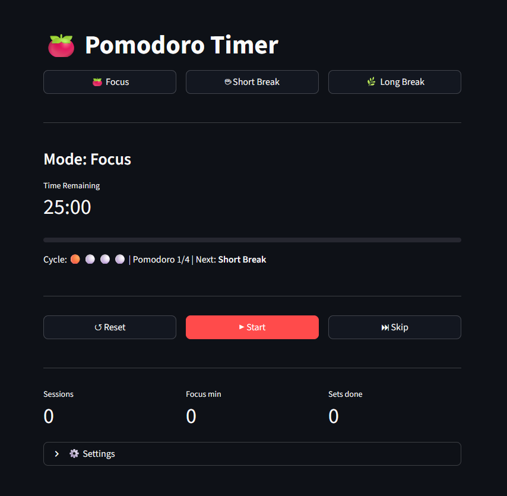

# 🍅 Pomodoro Timer

A simple, distraction-free Pomodoro timer built with [Streamlit](https://streamlit.io). No accounts, no ads, no bloat — just a clean timer that keeps you focused.

## What is the Pomodoro Technique?

The Pomodoro Technique is a time management method that breaks work into focused intervals (traditionally 25 minutes) separated by short breaks. Every 4 focus sessions earn a longer break.



## Features

- ⏱ **Accurate timing** — wall-clock delta timing, zero drift regardless of Streamlit rerun speed
- 🔄 **Full cycle management** — auto-advances Focus → Short Break → Long Break (every 4th) → repeat
- 🔴 **Cycle dots** — visual indicator of completed, current, and upcoming sessions in the cycle
- 🔔 **Audio alarm** — plays a custom MP3 when any session completes
- ▶ **Auto-start** — optionally continues to the next session hands-free
- 📊 **Live stats** — sessions completed, total focus minutes, sets done
- ⚙️ **Customisable durations** — adjust Focus, Short Break, and Long Break lengths
- 🐳 **Docker ready** — ships with a Dockerfile and Compose file

## Screenshot



## Project Structure

```bash
.
├── main.py            # Streamlit app (fully documented)
├── alarm.mp3          # Audio alarm played on session complete
├── screenshot.png     # App screenshot
├── pyproject.toml     # Project metadata and dependencies
├── uv.lock            # Locked dependency versions
├── Dockerfile         # Container image
├── docker-compose.yml # Compose configuration
└── README.md
```

## Getting Started

### Prerequisites

- Python 3.11 or newer
- `alarm.mp3` in the project root (replace with any MP3 you like)

### Run with uv (recommended)

[uv](https://github.com/astral-sh/uv) is a fast Python package manager.

```bash
# Install uv if you don't have it
curl -Ls https://astral.sh/uv/install.sh | sh

# Run the app
uv run streamlit run main.py
```

### Run with pip

```bash
pip install streamlit
streamlit run main.py
```

### Run with Docker

```bash
docker compose up --build
```

Or without Compose:

```bash
docker build -t pomodoro-timer .
docker run -p 8501:8501 pomodoro-timer
```

Then open [http://localhost:8501](http://localhost:8501) in your browser.

## Usage

| Control                                    | Action                                         |
| ------------------------------------------ | ---------------------------------------------- |
| **🍅 Focus / ☕ Short Break / 🌿 Long Break** | Switch mode and reset timer                    |
| **▶ Start**                                | Begin counting down                            |
| **⏸ Pause**                                | Pause without losing progress                  |
| **↺ Reset**                                | Restart the current session from full          |
| **⏭ Skip**                                 | Complete the current session early and advance |

### Cycle dots

```text
🔴 = completed this cycle
🟠 = currently in progress
⚪ = upcoming
```

### Settings

Open **⚙️ Settings** at the bottom to change durations:

| Setting                 | Default | Range      |
| ----------------------- | ------- | ---------- |
| Focus                   | 25 min  | 1 – 90 min |
| Short break             | 5 min   | 1 – 30 min |
| Long break              | 15 min  | 1 – 60 min |
| Auto-start next session | On      | On / Off   |

Click **✅ Apply & reset timer** to save.

## Customising the Alarm

Drop any MP3 file into the project root and rename it `alarm.mp3`. The file is base64-encoded at startup and embedded directly in the page — no static file server required.

## How It Works

### Timing accuracy

Rather than subtracting a fixed 1-second interval each tick, the timer measures the actual wall-clock elapsed time between Streamlit reruns:

```python
dt = time.time() - ss.last_tick
ss.remaining = max(0.0, ss.remaining - dt)
```

This means timing is accurate even if a rerun takes 1.3 seconds instead of exactly 1.0. A 25-minute session completes within ~1 second of the true mark.

### Cycle logic

`sessions_in_cycle` tracks position within the current set of 4, and is incremented *before* deciding the next mode:

```python
ss.sessions_in_cycle = (ss.sessions_in_cycle + 1) % LONG_EVERY
next_mode = "Long Break" if ss.sessions_in_cycle == 0 else "Short Break"
```

When `sessions_in_cycle` wraps back to 0, the user has completed 4 focus sessions and earns a Long Break.

## Contributing

Contributions are welcome! Feel free to open an issue or pull request for:

- Bug fixes
- UI improvements
- New features (keyboard shortcuts, desktop notifications, themes)
- Documentation improvements

Please keep PRs focused and include a clear description of what changed and why.

## License

MIT — see [LICENSE](LICENSE) for details.
